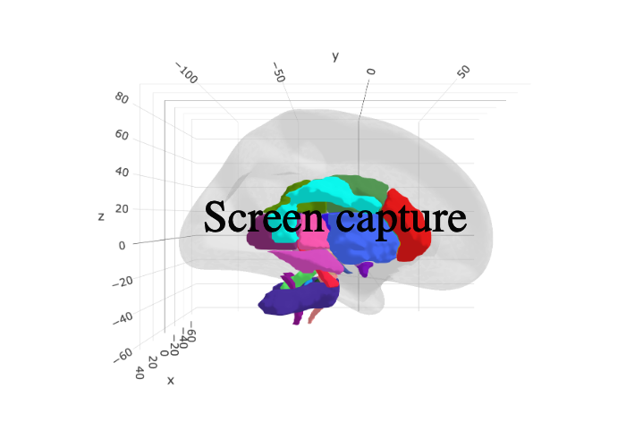

<!-- README.md is generated from README.Rmd. Please edit that file -->

```{r, include = FALSE}
knitr::opts_chunk$set(
  collapse = TRUE,
  comment = "#>",
  fig.path = "man/figures/README-",
  fig.width = 6,
  out.width = "100%"
)
devtools::load_all(".")
```

# ggsegICBM

<!-- badges: start -->
[](https://ci.appveyor.com/project/LCBC-UiO/ggsegICBM)
[](https://travis-ci.com/LCBC-UiO/ggsegICBM)
<!-- badges: end -->

This package contains dataset for plotting the ICBM white tract atlas ggseg and ggseg3d. 

Mori et al., MRI Atlas of Human White Matter. Elsevier, Amsterdam, The Netherlands (2005) 
[pubmed](href{https://www.elsevier.com/books/mri-atlas-of-human-white-matter/mori/978-0-444-51741-8)

## Installation

You can install the released version of ggsegICBM from [GitHub](https://github.com/) with:

``` r
# install.packages("remotes")
remotes::install_github("LCBC-UiO/ggsegICBM")
```

## Example
```{r}
library(ggsegICBM)
```

<!-- ```{r, fig.height=10} -->
<!-- library(ggseg) -->

<!-- ggseg(atlas = icbm, mapping = aes(fill = region)) + -->
<!--   scale_fill_brain("icbm", package = "ggsegICBM") + -->
<!--   theme(legend.position = "bottom", -->
<!--         legend.text = element_text(size = 7)) + -->
<!--   guides(fill = guide_legend(ncol = 2)) -->

<!-- ``` -->

```{r "noneval", eval=FALSE}
library(ggseg3d)

ggseg3d(atlas = icbm_3d) %>% 
  add_glassbrain("left") %>% 
  pan_camera("right lateral")
```

```{r "orca", include=FALSE}
library(ggseg3d)

p <- ggseg3d(atlas = icbm_3d) %>%
  add_glassbrain("left") %>% 
  pan_camera("right lateral") %>%
  plotly::add_annotations( text="Screen capture",
                  legendtitle=TRUE, showarrow=FALSE,
                  font = list(color = "#000000b4",
                              family = 'sans serif',
                              size = 50))
plotly::orca(p, "man/figures/README-3d-plot.png")
```

```{r "incl", echo=FALSE}

```

Please note that the 'ggsegICBM' project is released with a
[Contributor Code of Conduct](CODE_OF_CONDUCT.md).
By contributing to this project, you agree to abide by its terms.
